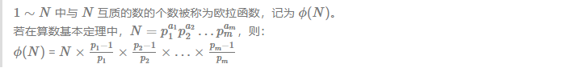
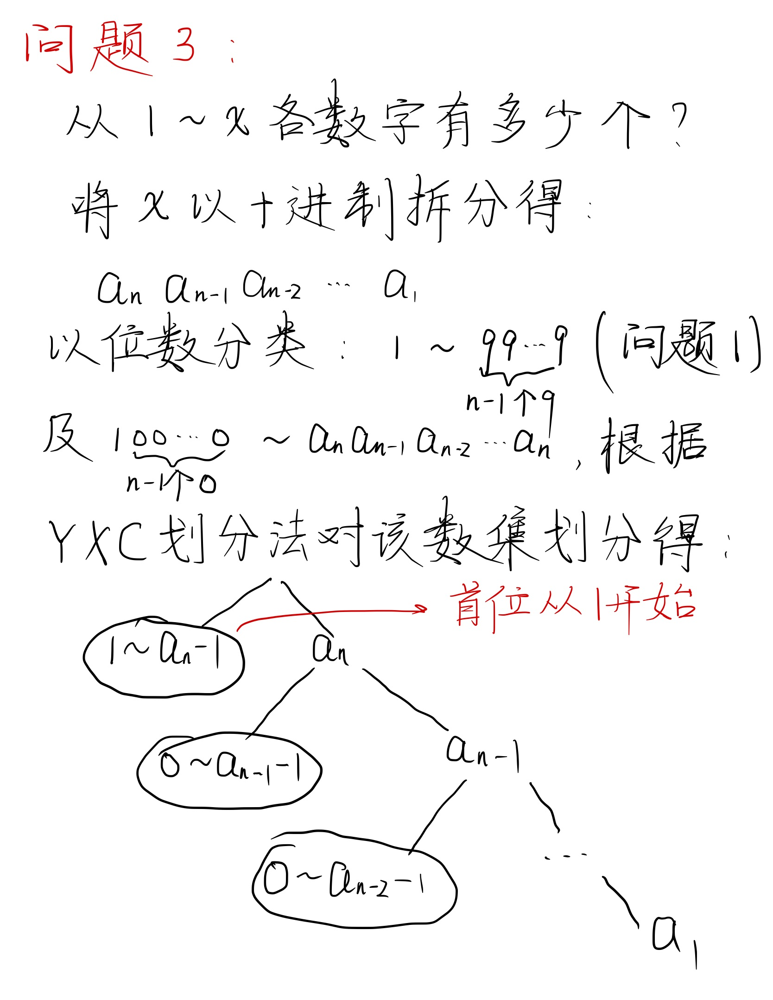
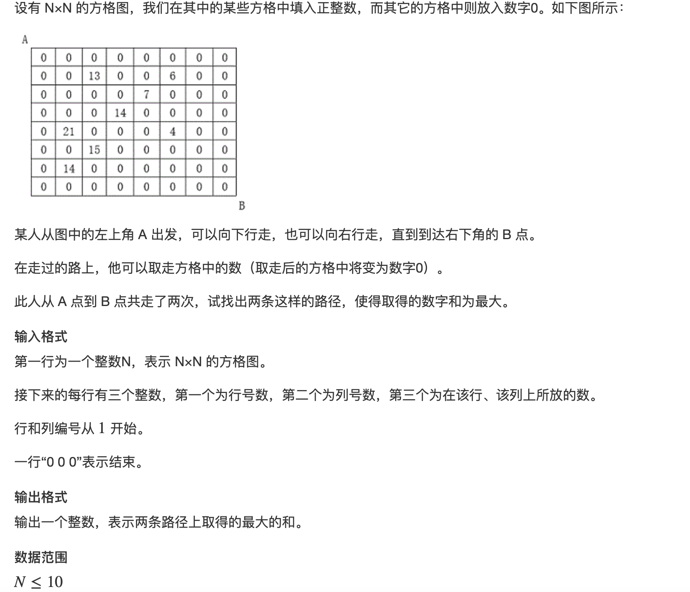

# 算法模板

* 本文为常用的一些算法模板。

## 快速幂

* 思想： 实际上是一种倍增的思想
* 时间复杂度显然为   $\log{b}$

``` c++
int qmi(int a, int b, int p) {
    int ret = 1;
    while(b) {
        if(b & 1) {
        	ret = ret * a % p;
        }
        a = a * a % p;
        b >>= 1;
    }
    return ret;
}
```

* 引申出一种变形，**龟速乘**（主要用于处理大数乘法取模问题）取代传统的大数乘法。

```c++
// solve a * b % c
LL qmi(LL a, LL b, LL c) {
    LL ret = 0;
    while(b) {
        if(b & 1) {
            ret  = (ret + a) % c;
        }
        a = (a + a) % c;
        b >>= 1;
    }
    return ret;
}
```

## st表

* st表**只能支持静态查询，并不能支持修改操作**！
* 主要思想：**倍增，打表**。

* 模板例子，查找区间内的最大值

```c++
void init(int n) {
    //预处理指数运算（也可以不做）
    p[0] = 1;
    for (int i=1; i<=M; i++) {
        p[i] = p[i-1]*2;
    }
    for(int i=1; i<=n; i++) {
        f[i][0] = a[i];
    }
    //注意这里递推式的写法，要先循环j（指数距离）
    for(int j=1; j<M; j++) {
        for(int i=1; (i + p[j] - 1)<=n; i++) {
            f[i][j] = max(f[i][j-1],f[i + p[j-1]][j-1]); 
        }
    }
}
int query(int l, int r) {
    int dis = (int)(log(r - l + 1)/log(2));
    return max(f[l][dis], f[r - p[dis] + 1][dis]);
}
```

## 递推求连续指数和

* 本质上是如下的一种递推优化：(下列式子中x为奇数，x为偶数的情况可以转换为奇数的情况)

**$1 + a^1 + a^2 + ... + a^x = ( 1 + a^\left( \frac x2 + 1 \right) ) * (1 + a^1 + a^2 + ... + a^ \frac x2 )$**

* 模板类似如下：

```c++
int qmi(int a, int b) {
    int ret = 1;
    a = a%MOD; // ret * a，a * a可能会越界的，要先取模！！！
    while(b) {
        if(b & 1) {
            ret = (ret * a)%MOD;
        }
        a = (a * a)%MOD;
        b >>= 1;
    }
    return ret;
}
int sum(int a, int x) {
    if(x == 0) {
        return 1;
    }
    if(x % 2==1) {
        return (qmi(a, x/2 + 1) + 1) * sum(a, x/2) % MOD;
    }
    else {
        x--;
        return (1 + ((a % MOD) * ((qmi(a, x/2 + 1) + 1) * sum(a, x/2) % MOD)) % MOD)%MOD;
    }
}
```

* 该模板可以用来解决求 **约数和** 问题

## 求长度不小于L的连续子序列平均值最大值

* 思路：对答案进行二分（预先是知道平均值可能的最大值和最小值的），假定当前的二分值为avg，那么将数组中的每个数都减去avg，那么问题就变成了求在新数组中长度不小于L的连续子序列之和是否能大于等于0。
* 化简后的问题易想到用前缀和解决。问题为

$$\mathop{\max}\limits_{L<=i<=n}\{sum_i - \mathop{\min}\limits_{0<=j<=i-L}\{sum_j\}\}$$

* 模板如下：

```c++
bool check(double val) { //对答案进行二分
    double min_val = 2000.0;
    for(int i=1; i<=n; i++) {
        s[i] = a[i] - val;
        s[i] += s[i-1];
    }
    for(int i=f; i<=n; i++) {
        min_val = min(min_val, s[i-f]);
        if((s[i] - min_val)>=0.0) {
            return true;
        }
    }
    return false;
}
// 实际二分
while((r - l) > 1e-5) {
    double mid = (l + r) / 2.0;
    if(check(mid)) {
        l = mid;
    }
    else {
        r = mid;
    }
}
```

## 求逆序对模板

* 在归并排序中进行。

* 模板如下：

```c++
typedef long long LL;
LL cal_reverse(int l, int r) {
    if(l == r) {
        return 0;
    }
    int mid = (l + r) >> 1;
    LL ret = 0;
    ret += cal_reverse(l,mid);
    ret += cal_reverse(mid+1,r);
    int i = l, j = (mid+1);
    int cur = 0;
    while(i <= mid && j<= r) {
        if(a[i] < a[j]) {
            b[cur++] = a[i];
            i++;
        }
        else {
            ret+=(mid - i + 1);//要注意不是加1！！！！
            b[cur++] = a[j];
            j++;
        }
    }
    if(i <= mid) {
        memcpy(b + cur, a + i, sizeof(LL) * (mid - i + 1));
    }
    if(j <= r) {
        memcpy(b + cur, a + j, sizeof(LL) * (r - j + 1));
    }
    memcpy(a + l, b, sizeof(LL) * (r - l + 1));
    return ret;
}
```

* 应用题目：二元数组逆序对。题目如下：


* 分析：这题是可以根据第一个key进行排序的，因为其实一致性和单调性有关，交换位置其实是不影响的！！！所以时间复杂度就是O(nlogn)

```c++
#include <iostream>
#include <cstdio>
#include <vector>
#include <algorithm>
using namespace std;
typedef long long LL;
const int N = 2e5 + 10;
pair<int, int> a[N];
bool cmp(pair<int, int>a, pair<int, int>b)
{
    return a.first<b.first;//根据fisrt的值升序排序
    //return a.second<b.second;//根据second的值升序排序
}
LL merge_sort(int l, int r) {
    if(l>=r) {
        return 0;
    }
    LL res = 0;
    vector<pair<int, int>> v(r - l + 1, {0, 0});
    int mid = (l + r) >> 1;
    res += merge_sort(l, mid);
    res += merge_sort(mid+1, r);
    int p = l;
    int q = mid + 1;
    int cur = 0;
    while(p <= mid && q <= r) {
        if(a[p].second < a[q].second) {
            v[cur++] = a[p];
            p++;
        } else {
            v[cur++] = a[q];
            res += (mid - p + 1);
            q++;
        }
    }
    if(p<=mid) {
        for(int i=p; i<=mid;i++) {
            v[cur++] = a[i];
        }
    }
    if(q<=r) {
        for(int i=q; i<=r; i++) {
            v[cur++] = a[i];
        }
    }
    for(int i=0; i<v.size(); i++) {
        a[i + l] = v[i];
    }
    return res;
}
int main()
{
    int n;
    scanf("%d",&n);
    for(int i=1; i<=n; i++) {
        scanf("%d%d",&(a[i].first), &(a[i].second));
    }
    LL total = (LL)n*(n-1)/2;
    sort(a+1, a+n+1, cmp);
    LL res = merge_sort(1, n);
    cout << (total - res - res) <<endl;
    return 0;
}
```


## 动态求中位数

* 给定一个输入，要求当输入个数为奇数时，输出中位数。
* 思路：用两个堆来解决，假定序列中从小到大排行为1~M/2的在一个大顶堆，M/2 + 1的在小顶堆。在插入的时候要注意，能放到小顶堆的优先放到小顶堆，否则都放到大顶堆。
* 算法模板如下：

```c++
for(int i=1; i<=m; i++) {
    int tmp;
    scanf("%d",&tmp);
    if(!down_queue.empty()) {
        if(tmp<down_queue.top()) {
            up_queue.push(tmp);
        }
        else {
            down_queue.push(tmp);
        }
    }
    else {
        up_queue.push(tmp);
     }
     if(i%2 == 1) {
        while(((int)down_queue.size()-(int)up_queue.size()) > 1) {
            tmp = down_queue.top();
            down_queue.pop();
            up_queue.push(tmp);
        }
        while(((int)down_queue.size()-(int)up_queue.size()) < 1) {
            tmp = up_queue.top();
            up_queue.pop();
            down_queue.push(tmp);
        }
        ans[cur++] = down_queue.top();
     }
}
```

## 快排模板

* yxc模板（相当于是确定一个端点x，x左边（包含x）的满足a[i]<=pivot，x右边（不包含x）的满足a[i]>pivot。

```c++
void quick_sort(int st, int en) {
    if(st >= en) return;
    int x = a[(st + en) >> 1]; // 这种模板是不能取右端点的值的，不然会无限递归，最好就是取中间的点
    int i = st - 1;
    int j = en + 1;
    while(i < j) {
        do {
            i++;
        // 不能用<=，因为这样可能会造成数组越界
        // 而且用<的话，相等的值放哪边都可以
        }while(a[i] < x); // 肯定能停下来：
        // 之前一次都没swap，那么就相当于到en，最终停下来。
        // 之前swap过的话，那么右边肯定有较大值的！
        do {
            j--; // j是最后移动的
        }while(a[j] > x); // 最后停下来的点肯定是满足a[j] <= x，j左边的也都满足，换句话说，j左边的（包括j）这些数都是固定的了。
        if(i < j) {
            swap(a[i], a[j]);
        }
    }
    quick_sort(st, j); // 一定要用j，因为j是最后移动的
    quick_sort(j+1, en);
}
```

* 普通快排模板

```c++
void quick_sort(int l, int r) {
    if(l >= r) return;
    int start = l;
    int end = r;
    int pivot = a[(start + end) >> 1];
    swap(a[(start + end) >> 1],a[r]);
    while(l<r) {
        while(l<r && a[l] <= pivot) { // 这里可以取=的原因是，用pivot去做的话，等于的值在pivot左边（这个写法）是满足pivot定义的，不需要交换！当然不取=也可以！
            l++;
        }
        if(l < r) {
           a[r--] = a[l]; 
        }
        while(l < r && a[r] >= pivot) {
            r--;
        }
        if(l < r) {
            a[l++] = a[r];
        }
    }
    a[l] = pivot;
    int tmp = l - 1;
    while(tmp>=start && a[tmp] == pivot) {
        tmp--;
    }
    quick_sort(start, tmp);
    tmp = l+1;
    while(tmp<=end && a[tmp] == pivot) {
        tmp++;
    }
    quick_sort(tmp, end);
}
```

* 快排算法模板（另）

```c++
void quick_sort(int l, int r) {
    if(l >= r) return;
    int start = l;
    int end = r;
    int pivot = a[(start + end) >> 1];
    while(l<r) {
        while(l<r && a[l] < pivot) {
            l++;
        }
        while(l < r && a[r] > pivot) {
            r--;
        }
        if(l < r) {
            swap(a[l], a[r]);
            if(a[l] == pivot && a[r] == pivot) {
                while(l < r&&a[r] == pivot) {
                    r--;
                }
            } else if(a[l] == pivot){
                r--;
            } else {
                l++;
            }
        }
    }
    int tmp = l - 1;
    while(tmp>=start && a[tmp] == pivot) {
        tmp--;
    }
    quick_sort(start, tmp);
    tmp = l+1;
    while(tmp<=end && a[tmp] == pivot) {
        tmp++;
    }
    quick_sort(tmp, end);
}
```

## 树状数组

* 增加以及查询都是O(logn)的时间复杂度，但是只能单点修改。
* 活用了lowbit的性质。

```c++
int lowbit(int x)
{
    return x & -x;
}

void add(int x, int c)
{
    for (int i = x; i <= n; i += lowbit(i)) tr[i] += c;
}

int sum(int x)
{
    int res = 0;
    for (int i = x; i; i -= lowbit(i)) res += tr[i];
    return res;
}
```

## trie树

* 关键其实是**`son[N][26]`**。

```c++
int son[N][26];
int idx;
int e[N];
int cnt[N];
void insert(string s) {
    int fa = 0;
    for(char c:s) {
        if(son[fa][c - 'a'] == 0) {
            son[fa][c - 'a'] = ++idx;
            e[idx] = c;
        }
        fa = son[fa][c - 'a'];
    }
    cnt[fa]++;
}
int query(string s) {
    int fa = 0;
    for(char c:s) {
        if(son[fa][c - 'a'] == 0) {
            return 0;
        }
        fa = son[fa][c - 'a'];
    }
    return cnt[fa];
}
```

## 并查集

* 下面模板为比较经典的食物链题，并查集还维护了到父节点的距离d。

```c++
#include <iostream>
using namespace std;
const int N = 5e4+10;
int fa[N];
int d[N]; // 注意d[]表示的是到父节点的距离，只是find会有路径压缩，因此find函数中，要保存原来的父节点，调用完原来父节点的find函数后，d[x] = d[x] + d[fa[x]]，fa[x]为原来的父节点
int find(int x) {
    if(fa[x] != x) {
        int tmp = find(fa[x]);
        d[x] += d[fa[x]];
        fa[x] = tmp;
    }
    return fa[x];
}
int main()
{
    int n, k;
    cin >> n >> k;
    for(int i=1; i<=n; i++) {
        fa[i] = i;
    }
    int fake = 0;
    for(int i = 0; i<k; i++) {
        int op, x, y;
        cin >> op >> x >> y;
        if(x > n || y > n) {
            fake++;
        } else if(op == 1) {
            int l = find(x);    
            int r = find(y);
            if(l == r && (d[x] - d[y])%3 != 0) {
                fake++;
            } else if(l != r) {
                fa[r] = l;
                d[r] = d[x] - d[y]; // 注意不能加d[l]，因为此时执行过了find函数，d[]表示到父节点的距离，此时调用过find函数，d[x]的父节点就是根节点！！！
                // 更新的d[r]会由下次find函数传下去。
            }
        } else {
            int l = find(x);    
            int r = find(y);
            if(l!=r) {
                fa[r] = l;
                d[r] = d[x] - d[y] + 1;
            } else if(l == r && (d[y] - d[x] - 1)%3!=0) {
                fake++;
            }
        }
    }
    cout << fake << endl;
    return 0;
}
```

## 手写堆

```c++
void up(int i) {
    while (i >> 1 && h[i >> 1] > h[i]) {
        swap(h[i >> 1], h[i]);
        i >>= 1;
    }
}
void down(int u)
{
    int t = u;
    if (u * 2 <= cnt && h[u * 2] < h[t]) t = u * 2;
    if (u * 2 + 1 <= cnt && h[u * 2 + 1] < h[t]) t = u * 2 + 1;
    if (u != t)
    {
        swap(h[u], h[t]);
        down(t);
    }
}
```

## 树的dfs模板

* 以树的重心模板为例，树的重心定义：重心是指树中的一个结点，如果将这个点删除后，剩余各个连通块中点数的最大值最小，那么这个节点被称为树的重心。

```c++
#include <iostream>
#include <cstring>
using namespace std;
const int N = 1e5 + 10;
int h[N];
int ne[N*2];
int e[N*2];
int idx;
int n;
int res;
void add(int a, int b) {
    e[idx] = b; ne[idx] = h[a]; h[a] = idx++;
}
int dfs(int cur, int par) { // 不要重复遍历！树的总点数是固定的！
    int size = 0;
    int sum = 0;
    for(int i=h[cur]; ~i; i=ne[i]) {
        int u = e[i];
        if(u == par) {
            continue;
        }
        int val = dfs(u, cur);
        size = max(size, val);
        sum += val;
    }
    size = max(size, n-1-sum);
    res = min(res, size);
    return sum+1;
}
int main()
{
    memset(h, -1, sizeof(h));
    cin >> n;
    for(int i = 1; i < n; i++) {
        int a, b;
        cin >> a >> b;
        add(a, b);
        add(b, a);
    }
    res = n;
    dfs(1, -1);
    cout << res << endl;
    return 0;
}
```

## 求拓扑序列

* 递归删去入度为0的点。

```c++
#include <iostream>
#include <vector>
#include <cstring>
#include <queue>
using namespace std;
int n, m;
const int N = 1e5+10;
int e[N];
int h[N];
int ne[N];
int degree[N];
bool st[N];
int idx;
void add(int a, int b) {
    e[idx] = b; ne[idx] = h[a]; h[a] = idx++; degree[b]++;
}
int main()
{
    memset(h,-1,sizeof(h));
    cin >> n >> m;
    while(m--) {
        int a, b;
        cin >> a >> b;
        add(a, b); // 自环也是环！自环也会算入度！
    }
    vector<int> ans;
    // 类似层序遍历
    queue<int> q;
    for(int i=1; i<=n; i++) {
        if(degree[i]==0) {
            q.push(i);
        }
    }
    if(q.empty()) {
        cout << -1 << endl;
        return 0;
    }
    while(!q.empty()) {
        int qlen = q.size();
        for(int i=0; i<qlen; i++) {
            int node = q.front();
            ans.push_back(node);
            q.pop();
            for(int i = h[node];~i;i=ne[i]) {
                int j = e[i];
                degree[j]--;
                if(degree[j] == 0) {
                    q.push(j);
                }
            }
        }
    }
    if(ans.size()!=n) {
        cout << -1 << endl;
    } else {
        for(int i=0; i<n; i++) {
            cout << ans[i] << " ";
        }
        cout << endl;
    }
    return 0;
}
```

## 普通Dijkstra模板

* 时间复杂度为O(n^2)
* 证明如下：


* 模板为

```c++
int dijkstra() {
    memset(dist, 0x3f, sizeof(dist));
    dist[1] = 0;
    for(int i=0; i< n-1; i++) {
        int t=-1;
        for(int j=1; j<=n; j++) {
            if((!st[j])&&(t == -1 || dist[t] > dist[j]))
                t=j;
        }
        for(int j=1; j<=n; j++) {
            dist[j] = min(dist[j], dist[t]+matrix[t][j]);
        }
        st[t] = true;
    }
    if(dist[n] == 0x3f3f3f3f) {
        return -1;
    } else {
        return dist[n];
    }
}
```

## 堆优化Dijkstra模板

* 时间复杂度为O(mlog(n))。
* 相比于普通的Dijkstra，采用堆去优化找每次最小dist的过程。
* 还有一个注意的点是，**从堆中出来的点才去处理st的逻辑，和bfs区分开！！！**

```c++
int dijkstra() {
    memset(dist,0x3f,sizeof(dist));
    dist[1] = 0;
    priority_queue<pair<int,int>, vector<pair<int,int>>, std::greater<pair<int,int>>> pq;
    pq.push({0, 1});
    while(!pq.empty()) {
        auto p = pq.top();
        pq.pop();
        int node = p.second;
        if(st[node]) {
            continue;
        }
        st[node] = true;
        for(int i = h[node]; ~i; i=ne[i]) {
            int j = e[i];
            int len = w[i];
            if(dist[j] > (dist[node] + len)) {
                dist[j] = (dist[node] + len);
                pq.push({dist[j], j});
            }
        }
    }
    if(dist[n] == 0x3f3f3f3f)
        return -1;
    else
        return dist[n];
}
```

## bellman-ford算法模板

* 对于求从 1 号点到 n 号点的最多经过 k 条边的最短距离，用bellman-ford算法解决。在这个背景下，是可以允许存在负环的。
* 时间复杂度显然是O(k*m)。

```c++
void bellman_ford() {
    memset(dist, 0x3f, sizeof(dist));
    dist[1] = 0;
    for(int i=0; i<k; i++) {
        memcpy(last, dist, sizeof(dist));
        for(int j=0; j<m; j++) {
            auto e = edges[j];
            dist[e.b] = min(dist[e.b], last[e.a]+e.c);
        }
    }
}
```

## spfa算法模板

* 时间复杂度最差会退化为bellman-ford算法，时间复杂度一般为O(m)。

```c++
void spfa()
{
    memset(dist, 0x3f, sizeof(dist));
    dist[1] = 0;
    queue<int> q;
    q.push(1);
    st[1]=true; // st其实只是一个标记，表示的是当前是否在queue中，是可能会多次入队的！
    while(!q.empty()) {
        int node = q.front();
        q.pop();
        st[node] = false;
        for(int i = h[node]; ~i; i=ne[i]) {
            int j = e[i];
            int len = w[i];
            if(dist[j] > dist[node] + len) {
                dist[j] = dist[node] + len;
                if(!st[j]) { // 如果此时在queue中，由于更新了dist数组，当这个点出队时依然能拿到这个更小的值
                    st[j] = true;
                    q.push(j);
                }
            }
        }
    }
}
```

* 堆优化版Dijkstra算法中的st数组保存的是当前确定了到源点距离最小的点，且一旦确定了最小那么就不可逆了(不可标记为true后改变为false)；SPFA算法中的st数组仅仅只是表示的当前发生过更新的点，且spfa中的st数组可逆(可以在标记为true之后又标记为false)。
* Bellman_ford算法可以存在负权回路，是因为其循环的次数是有限制的因此最终不会发生死循环；但是SPFA算法不可以，由于用了队列来存储，只要发生了更新就会不断的入队，因此**假如有负权回路就不要用SPFA否则会死循环**。

## spfa判负环

```c++
bool spfa() {
    queue<int> q;
    // 相当于建立一个虚拟原点，这么做的原因是不知道负环在哪里。
    for(int i=1; i<=n; i++) {
        q.push(i);
        st[i]=true;
    }
    while(!q.empty()) {
        int node = q.front();
        q.pop();
        st[node] = false;
        for(int i=h[node]; ~i; i=ne[i]) {
            int j =e[i];
            if(dist[j] > (dist[node] + w[i])) {
                dist[j] = dist[node] + w[i];
                cnt[j] = cnt[node] + 1; // // cnt表示边数
                if(cnt[j] >= n) {
                    return true;
                }
                if(!st[j]) {
                    st[j] = true;
                    q.push(j);
                }
            }
        }
    }
    return false;
}
```

## floyd模板

```c++
void floyd() {
    for(int k=1; k<=n; k++) {
        for(int i=1;i<=n;i++) {
            for(int j=1; j<=n; j++) {
                dist[i][j] = min(dist[i][j], dist[i][k] + dist[k][j]);
            }
        }
    }
}
```

## Prim模板

```c++
bool prim() {
    memset(dist,0x3f,sizeof(dist));
    dist[1] = 0;
    for(int i=0; i<n; i++) {
        int t = -1;
        for(int j=1; j<=n; j++) {
            if((!st[j])&&(t==-1||dist[j] < dist[t])) {
                t = j;
            }
        }
        if(dist[t] == 0x3f3f3f3f) {
            return false;
        }
        st[t] = true;
        route += dist[t];
        for(int j=1; j<=n; j++) {
            if(st[j]) {
                continue;
            }
            dist[j] = min(dist[j], matrix[t][j]);
        }
    }
    return true;
}
```

## Kruscal模板

```c++
#include <iostream>
#include <algorithm>
using namespace std;
int n, m;
const int M = 2e5+10;
const int N = 1e5+10;
int route;
int fa[N];
int node_size[N];
int find(int x) {
    if(fa[x]!=x) {
        fa[x] = find(fa[x]);
    }
    return fa[x];
}
struct Edge
{
    int a, b, c;
}edges[M];
bool cmp(const Edge& e1, const Edge& e2) {
    return e1.c < e2.c;
}
bool kruscal() {
    for(int i=1; i<=n; i++) {
        fa[i] = i;
        node_size[i] = 1;
    }
    for(int i=0; i<m; i++) {
        if(edges[i].a == edges[i].b) {
            continue;
        }
        int src = edges[i].a;
        int dst = edges[i].b;
        int pa = find(src);
        int pb = find(dst);
        if(pa == pb) {
            continue;
        }
        fa[pb] = pa;
        node_size[pa] += node_size[pb];
        route+=edges[i].c;
        if(node_size[pa] == n) {
            return true;
        }
    }
    return false;
}
int main()
{
    cin >> n >> m;
    for(int i=0; i<m; i++) {
        int a, b, c;
        cin >> a >> b >> c;
        edges[i] = {a, b, c};
    }
    sort(edges, edges+m, cmp);
    if(kruscal()) {
        cout << route << endl;
    } else {
        puts("impossible");
    }
    return 0;
}
```

* 时间复杂度显然为**`O(mlogm)`**。

## 匈牙利算法（最大二分匹配）

* 算法描述（记忆方法）：
  * 遍历所有男生
    让该男生考虑所有心动女生
    如果当前女生单身，或者该女生的对象找了备胎，该女生就接受该男生
    最坏时间复杂度 O(nm)，和其它最大流问题一样，实际比较快

```c++
#include <iostream>
#include <cstring>
using namespace std;
const int N = 500+10;
const int M = 1e5+10;
int h[N];
int e[M];
int ne[M];
int idx;
int n1, n2, m;
int match[N];
bool st[N];
void add(int a, int b) {
    e[idx] = b; ne[idx] = h[a]; h[a] = idx++;
}
bool find(int index) {
    for(int i=h[index]; ~i; i=ne[i]) {
        int j = e[i];
        if(!st[j]) {
            st[j] = true;
            if(!match[j] || find(match[j])) {
                match[j] = index;
                return true;
            }
       } 
    }
    return false;
}
int main()
{
    memset(h,-1,sizeof(h));
    cin >> n1 >> n2 >> m;
    while(m--) {
        int a, b;
        cin >> a >> b;
        add(a, b);
    }
    int res = 0;
    for(int i=1; i<=n1; i++) {
        memset(st,false,sizeof(st));
        if(find(i)) {
            res++;
        }
    }
    cout << res << endl;
    return 0;
}
```

* 注意的点有：**每次进行find前都要memset st数组都为false**；**find函数中对于match的处理逻辑**。

## 埃氏筛法

* 时间复杂度为**`O(nloglogn)`**。

```c++
#include <iostream>
using namespace std;
const int N = 1e6+10;
bool st[N];
typedef long long LL;
int main()
{
    int n;
    cin >> n;
    int res = 0;
    for(int i=2; i<=n; i++) {
        if(!st[i]) {
            res++;
            for(LL j = (LL)i*i; j <= (LL)n; j+=i) {
                st[(int)j] = true;
            }
        }
    }
    cout << res << endl;
    return 0;
}
```

## gcd模板

```c++
int gcd(int a, int b) {
    return b?gcd(b, a%b):a;
}
```

## 欧拉函数



```c++
int euler(int x) {
    vector<int> v;
    int ori = x;
    for(int i=2; i<=(x/i); i++) {
        if(x%i==0) {
            v.push_back(i);
            while(x%i==0) {
                x=x/i;
            }
        }
    }
    if(x!=1) {
        v.push_back(x);
    }
    int ret = ori;
    for(int i=0; i<(int)v.size(); i++) {
        ret = ret/v[i]*(v[i]-1);
    }
    return ret;
}
```

## 求 1∼n中每个数的欧拉函数之和。

* 采用线性筛的思想

```c++
#include <iostream>
#include <vector>
using namespace std;
typedef long long LL;
const int N = 1e6+10;
bool judge[N];
int cnt[N];
int main()
{
    int n;
    cin >> n;
    LL res = 1;
    vector<int> primes;
    for(int i=2; i<=n; i++) {
        if(!judge[i]) {
            judge[i] = true;
            cnt[i] = (i-1);
            primes.push_back(i);
        }
        for(int j = 0; primes[j] <= (n/i);j++) {
            judge[primes[j]*i] = true;
            if(i%primes[j] == 0) {
                cnt[primes[j]*i] = primes[j] * cnt[i];
                break;
            }
            cnt[primes[j]*i] = cnt[i] * (primes[j]-1);
        }
    }
    for(int i=2; i<=n; i++) {
        res += cnt[i];
    }
    cout << res << endl;
    return 0;
}
```

## 线性筛求质数个数

```c++
#include <iostream>
using namespace std;
const int N = 1e6+10;
bool st[N];
int primes[N];
typedef long long LL;
int main()
{
    int n;
    cin >> n;
    int cnt = 0;
    for(int i=2; i<=n; i++) {
        if(!st[i]) {
            primes[cnt++] = i;
        }
        for(int j=0; primes[j] <= n/i; j++) {
            st[i*primes[j]] = true;
            if(i%primes[j] == 0) {
                break;
            }
            
        }
    }
    cout << cnt << endl;
    return 0;
}
```

## 快速幂

```c++
LL qmi(LL a, LL b, LL p) {
    LL ret = 1;
    while(b > 0) {
        if(b&1) {
            ret = (ret*a)%p;
        }
        b >>= 1;
        a = a*a%p;
    }
    return ret;
}
```

## 扩展欧几里得算法


```c++
#include <iostream>
using namespace std;
int n;
int exgcd(int a, int b, int& x, int& y) {
    if(b == 0) {
        x=1;
        y=0;
        return a;
    }
    int ret = exgcd(b, a%b, x, y);
    int tmp = x;
    x=y;
    y=(tmp-(a/b)*y);
    return ret;
}
int main()
{
    cin >> n;
    while(n--) {
        int a, b;
        cin >> a >> b;
        int x, y;
        exgcd(a, b, x, y);
        cout << x <<" "<< y << endl;
    }
    return 0;
}
```

## 中国剩余定理

* 迭代的方式运用扩展欧几里得定理，重要的是这种迭代的思想。

```c++
#include <iostream>
using namespace std;
typedef long long LL;
LL exgcd(LL a, LL b, LL& x, LL& y) {
    if(b==0) {
        x = 1;
        y = 0;
        return a;
    }
    LL ret = exgcd(b, a%b, x, y);
    LL tmp = x;
    x = y;
    y = tmp-(a/b)*y;
    return ret;
}
LL gcd(LL a, LL b) {
    return b?gcd(b, a%b):a;
}
LL lcm(LL a, LL b) {
    LL max_divided = gcd(a, b);
    if(max_divided == 1) {
        return a*b;
    } else {
        return a * b / max_divided;
    }
}
int main()
{
    int n;
    cin >> n;
    LL a1, b1;
    cin >> a1 >> b1;
    if(n == 1) {
        cout << b1 << endl;
        return 0;
    }
    LL x, y;
    LL val;
    for(int i=1; i<n; i++) {
        LL a2, b2;
        cin >> a2 >> b2;
        LL common = gcd(a1, a2);
        if((b2 - b1)%common != 0) {
            cout << -1 << endl;
            return 0;
        }
        LL beishu = (b2 - b1)/common; // 这个可能会越int的界，一个改成LL，最好都改成LL！
        exgcd(a1, a2, x, y);
        LL num = lcm(a1, a2);
        x = beishu * x;
        x = (x % (a2/common) + (a2/common))%(a2/common);
        val = a1 * x + b1;
        a1 = num;
        b1 = val;
    }
    cout << val << endl;
    return 0;
}
```

## 高斯消元法解线性方程

* 初等行（列）变换规则：

  （1） 把某一行乘一个非0的数 (方程的两边同时乘上一个非0数不改变方程的解)

  （2） 交换某两行 (交换两个方程的位置)

  （3） 把某行的若干倍加到另一行上去 （把一个方程的若干倍加到另一个方程上去）

* 算法思想为：枚举每一列c，

  * 找到当前列绝对值最大的一行
  * 用初等行变换(2) 把这一行换到最上面（未确定阶梯型的行，并不是第一行）
  * 用初等行变换(1) 将该行的第一个数变成 1（其余所有的数字依次跟着变化）
  * 用初等行变换(3) 将下面所有行的当且列的值变成 0

```c++
#include <iostream>
#include <cmath>
#include <vector>
#include <algorithm>
using namespace std;
const int N = 110;
int n;
double a[N][N];
double ebs = 1e-6;
int main()
{
    cin >> n;
    for(int i=0; i<n; i++) {
        for(int j=0; j<=n; j++) {
            cin >> a[i][j];
        }
    }
    int c, r;
    for(c=0, r=0;c<n; c++) {
        int t = r;
        for(int i=r; i<n; i++) {
            if(fabs(a[i][c]) > fabs(a[t][c])) {
                t = i;
            }
        }
        if(fabs(a[t][c]) < ebs) {
            continue;
        }
        // swap
        for(int i=c; i<=n; i++) {
            swap(a[r][i], a[t][i]);
        }
        //normalize
        for(int i=n; i>=c; i--) { // 注意这里要倒着进行！！！
            a[r][i]=a[r][i]/a[r][c];
        }
        //消元
        for(int i=(r+1); i<n; i++) {
            if(fabs(a[i][c]) < ebs) {
                continue;
            }
            for(int j=n; j>=c; j--) { // 注意要倒着遍历！！！因为正着来的话a[i][c]会变！
                a[i][j] = (a[i][j] - a[i][c]*a[r][j]);
            }
        }
        r++;
    }
    if(r<n) {
        for(int i=r; i<n; i++) {
            if(fabs(a[i][n])>ebs) {
                cout << "No solution" << endl;
                return 0;
            }
        }
        cout << "Infinite group solutions" << endl;
        return 0;
    }
    for(c=(n-1), r=(n-1); c>0; c--) {
        for(int i = (r-1); i>=0; i--) {
            a[i][n]-=a[i][c]*a[r][n];
        }
        r--;
    }
    for(int i=0; i<n; i++) {
        printf("%.2lf\n",a[i][n]);
    }
    return 0;
}
```

* **一定要注意上面一些消元步骤一定要倒着进行！！！**

## 求组合数

* 数值范围较小时，用类似动态规划的思想解决。

```c++
	for(int i=0; i<=maxcnt; i++) {
        c[i][0] = 1;
    }
    for(int i=1; i<=maxcnt; i++) {
        for(int j=1; j<=i; j++) {
            c[i][j] = c[i-1][j] + c[i-1][j-1];
        }
    }
```

* 数据范围较大（1≤b≤a≤10^5且涉及到求模）时，用费马定理+快速幂进行解决。

```c++
#include <iostream>
using namespace std;
typedef long long LL;
const int MOD = 1e9+7;
const int N = 1e5+10;
LL fact[N];
LL infact[N];
LL qmi(LL a, LL b, LL m) {
    LL ret = 1;
    while(b) {
        if(b&1) {
            ret = ret*a%m;
        }
        b >>= 1;
        a = a*a%MOD;
    }
    return ret;
}
int main()
{
    int n;
    cin >> n;
    fact[0] = 1;
    infact[0]=1;
    for(int i=1; i<=1e5; i++) {
        fact[i] = fact[i-1] * i % MOD;
        infact[i] = infact[i-1] * qmi(i, MOD-2, MOD) % MOD;
    }
    while(n--) {
        int a, b;
        cin >> a >> b;
        cout << (((fact[a] * infact[b])%MOD) * infact[a-b])%MOD << endl;
    }
    return 0;
}
```

* 数据范围更大，且涉及到求模时，用卢卡斯定理。


```c++
#include <iostream>
using namespace std;
typedef long long LL;
LL qmi(LL a, LL b, LL p) {
    LL ret = 1;
    while(b) {
        if(b&1) {
            ret = ret*a%p;
        }
        b >>= 1;
        a = a*a%p;
    }
    return ret;
}
LL C(LL a, LL b, LL p) {
    if(b > a) {
        return 0;
    }
    if(b == 0) {
        return 1 % p;
    }
    LL ret = 1;
    for(LL i=a, j=1; j<=b; i--, j++) {
        ret = ret*i%p;
        ret = ret*qmi(j, p-2, p) % p;
    }
    return ret;
}
LL lucas(LL a, LL b, LL p) {
    if(a < p && b < p) return C(a, b, p);
    return C(a%p, b%p, p) * lucas(a/p, b/p, p) % p;
}
int main()
{
    int n;
    cin >> n;
    while(n--) {
        LL a, b, p;
        cin >> a >> b >> p;
        cout << lucas(a, b, p) << endl;
    }
    return 0;
}
```

* 数据范围很大，但不涉及求模，涉及到大数乘法时，用分解质因数并进行累积的方式进行解决。


```c++
#include <iostream>
#include <vector>
using namespace std;
const int N = 5010;
bool isPrime[N];
int primes[N];
int sum[N];
int cnt;
void get_primes(int n) {
    for(int i=2; i<=n; i++) {
        if(!isPrime[i]) {
            isPrime[i] = true;
            primes[cnt++] = i;
        }
        for(int j=0; primes[j] <= n/i; j++) {
            isPrime[i*primes[j]] = true;
            if(i%primes[j] == 0) {
                break;
            }
        }
    }
}
int get(int prime, int n) {
    int ret = 0;
    while(n) {
        ret += (n/prime);
        n = n/prime;
    }
    return ret;
}
vector<int> mul(vector<int> a, int b) {
    int jinwei = 0;
    vector<int> ret;
    for(int i=0; i<a.size(); i++) {
        int val = a[i]*b+jinwei;
        ret.push_back(val%10);
        jinwei = val/10;
    }
    while(jinwei) {
        ret.push_back(jinwei%10);
        jinwei = jinwei/10;
    }
    return ret;
}
int main()
{
    int a, b;
    cin >> a >> b;
    get_primes(a);
    for(int i = 0; i<cnt; i++) {
        sum[primes[i]] = get(primes[i], a) - get(primes[i], b) - get(primes[i], a-b);
    }
    vector<int> ret(1, 1);
    for(int i=0; i<cnt; i++) {
        for(int j=0; j<sum[primes[i]]; j++) {
            ret = mul(ret, primes[i]);
        }
    }
    for(int i=((int)ret.size()-1);i>=0;i--) {
        cout << ret[i];
    }
    cout << endl;
    return 0;
}
```

## 卡特兰数

* 能求解的问题如下：


* 模板题


* 公式为：


```c++
#include <iostream>
using namespace std;
typedef long long LL;
const LL MOD = 1e9+7;
const int N = 1e5+10;
LL n;
LL qmi(LL a, LL b, LL p) {
    LL ret = 1;
    while(b) {
        if(b&1) {
            ret = ret*a%p;
        }
        b >>= 1;
        a = a*a%p;
    }
    return ret;
}
int main()
{
    LL a, b;
    cin >> n;
    a = n*2;
    b = n;
    LL ret = 1;
    for(int i=(n*2); i>(n+1); i--) {
        ret = (ret*i)%MOD;
    }
    for(LL i = 2; i<=b; i++) {
        ret = ret * qmi(i, MOD-2, MOD) % MOD;
    }
    cout << ret << endl;
    return 0;
}
```

## 能被多个质数整除的个数问题


* 主要思路就是要**运用二进制数表示状态**，类似状态压缩DP表示状态的方式。

```c++
#include <iostream>
using namespace std;
typedef long long LL;
const int N = 20;
int primes[N];
int cnt[N];
int main()
{
    int n, m;
    cin >> n >> m;
    for(int i=0; i<m; i++) {
        cin >> primes[i];
    }
    LL ret = 0;
    for(int i = 1; i < (1<<m); i++) {
        int cnt = 0;
        LL num = 1;
        for(int j=0; j<m; j++) {
            if((i>>j)&1) {
                cnt++;
                num = num*(LL)primes[j];
                if(num > n) { // 这里多一步剪枝，最差情况下可能直接爆long long！！！
                    break;
                }
            }
        }
        if(cnt%2==0) {
            num = -num;
        }
        ret+=((LL)n/num);
    }
    cout << ret << endl;
    return 0;
}
```

## 博弈论

* Nim游戏

  * 给定 n 堆石子，两位玩家轮流操作，每次操作可以从任意一堆石子中拿走任意数量的石子（可以拿完，但不能不拿），最后无法进行操作的人视为失败。

    问如果两人都采用最优策略，先手是否必胜。

    

    ```c++
    #include <iostream>
    using namespace std;
    int main()
    {
        int n;
        cin >> n;
        int ret = 0;
        for(int i=0; i<n; i++) {
            int tmp;
            cin >> tmp;
            ret^=tmp;
        }
        if(ret!=0) {
            cout << "Yes" << endl;
        } else {
            cout << "No" << endl;
        }
        return 0;
    }
    ```

* 台阶-Nim游戏

  * 现在，有一个 n 级台阶的楼梯，每级台阶上都有若干个石子，其中第 i 级台阶上有 aii 个石子(i≥1)。

    两位玩家轮流操作，每次操作可以从任意一级台阶上拿若干个石子放到下一级台阶中（不能不拿）。

    已经拿到地面上的石子不能再拿，最后无法进行操作的人视为失败。

    问如果两人都采用最优策略，先手是否必胜。

    

    ```c++
    #include <iostream>
    using namespace std;
    int main()
    {
        int n;
        cin >> n;
        int ret = 0;
        for(int i=1; i<=n; i++) {
            int tmp;
            cin >> tmp;
            if(i%2==1) {
                ret^=tmp;
            }
        }
        if(ret!=0) {
            puts("Yes");
        } else {
            puts("No");
        }
        return 0;
    }
    ```

* 集合-Nim游戏

  * 给定 n 堆石子以及一个由 k 个不同正整数构成的数字集合 S。

    现在有两位玩家轮流操作，每次操作可以从任意一堆石子中拿取石子，每次拿取的石子数量必须包含于集合 S，最后无法进行操作的人视为失败。

    问如果两人都采用最优策略，先手是否必胜。

  

  ```c++
  #include <iostream>
  #include <cstring>
  #include <unordered_set>
  using namespace std;
  const int N = 110;
  const int M = 1e4+10;
  int nums[N];
  int stones[M];
  int k;
  int n;
  int sg(int x) {
      if(stones[x]!=-1) {
          return stones[x];
      }
      unordered_set<int> set;
      for(int i=0; i<k; i++) {
          if(x >= nums[i]) {
              set.insert(sg(x - nums[i]));
          }
      }
      for(int i=0;;i++) {
          if(set.find(i)==set.end()) {
              return stones[x] = i; // 记忆化搜索优化
          }
      }
      return -1;
  }
  int main()
  {
      memset(stones, -1, sizeof(stones));
      cin >> k;
      for(int i=0; i<k; i++) {
          cin >> nums[i];
      }
      int ret = 0;
      cin >> n;
      for(int i=0; i<n; i++) {
          int tmp;
          cin >> tmp;
          ret^=sg(tmp);
      }
      if(ret != 0) {
          puts("Yes");
      } else {
          puts("No");
      }
      return 0;
  }
  ```

* 拆分-Nim游戏

  * 给定 n 堆石子，两位玩家轮流操作，每次操作可以取走其中的一堆石子，然后放入两堆**规模更小**的石子（新堆规模可以为 0，且两个新堆的石子总数可以大于取走的那堆石子数），最后无法进行操作的人视为失败。

    问如果两人都采用最优策略，先手是否必胜。

  

  ```c++
  #include <iostream>
  #include <cstring>
  #include <unordered_set>
  using namespace std;
  const int N = 110;
  int f[N];
  int n;
  unordered_set<int> set;
  int sg(int x) {
      if(f[x]!=-1) {
          return f[x];
      }
      f[x] = 0;
      for(int i=0; i<x; i++) {
          for(int j=i; j<x; j++) {
              set.insert(sg(i)^sg(j));
          }
      }
      for(int i=0;;i++) {
          if(set.count(i)==0) {
              return f[x] = i;
          }
      }
      return -1;
  }
  int main()
  {
      cin >> n;
      memset(f, -1, sizeof(f));
      int ret = 0;
      for(int i=0; i<n; i++) {
          int tmp;
          cin >> tmp;
          ret ^= sg(tmp);
      }
      if(ret != 0) {
          puts("Yes");
      } else {
          puts("No");
      }
      return 0;
  }
  ```

## 分组背包问题

* 滚动数组优化后，**先遍历组，再遍历体积，最后遍历每个组内的item**。

```c++
#include <iostream>
#include <vector>
using namespace std;
const int N = 110;
int a[N];
int main()
{
    int n, total;
    cin >> n >> total;
    vector<vector<pair<int, int>>> items;
    for(int i=0; i<n; i++) {
        int nums;
        cin >> nums;
        vector<pair<int, int>> v;
        while(nums--) {
            int a, b;
            cin >> a >> b;
            v.push_back({a, b});
        }
        items.push_back(v);
    }
    for(int i=0; i<n; i++) {
        for(int j = total; j>=0; j--) {
           for(int k=0; k<items[i].size(); k++) {
                int volume = items[i][k].first;
                int value = items[i][k].second;
                if(j >= volume) {
                    a[j] = max(a[j], a[j-volume] + value);
                }
            } 
        }
    }
    cout << a[total] << endl;
    return 0;
}
```

## 最长上升子序列

* 用不了单调栈！！！
* 可以用二分搜索进行优化。


```c++
#include <iostream>
using namespace std;
const int N = 1010;
int a[N];
int f[N]; // 长度为i的最后一个值（尽可能的小）
int main()
{
    int n;
    cin >> n;
    int ret = 1;
    int cnt = 0;
    f[0] = -1e9-10;
    for(int i = 1; i<=n; i++) {
        f[i] = 1e9+10;
    }
    for(int i=1; i<=n; i++) {
        cin >> a[i];
        int l = 0;
        int r = cnt;
        while(l < r) {
            int mid = (l+r+1) >> 1;
            if(f[mid] < a[i]) {
                l = mid;
            } else {
                r = mid - 1;
            }
        }
        if(l==cnt) {
            cnt++;
        }
        ++l;
        f[l]=min(f[l], a[i]);
    }
    cout << cnt << endl;
    return 0;
}
```

## 整数拆分

* 一个正整数 n 可以表示成若干个正整数之和，形如：n=n1+n2+…+nk，其中 n1 ≥ n2 ≥ … ≥ nk, k≥1。

  我们将这样的一种表示称为正整数 n 的一种划分。

  现在给定一个正整数 n，请你求出 n 共有多少种不同的划分方法。

* 思路：把整个问题看成完全背包问题。


```c++
#include <iostream>
using namespace std;
const int N = 1e3+10;
int dp[N];
const int MOD = 1e9 + 7;
int main()
{
    int n;
    cin >> n;
    dp[0] = 1;
    for(int i = 1; i <= n; i++) {
        for(int j=i; j<=n; j++) {
            dp[j] = (dp[j - i] + dp[j])%MOD;
        } 
    }
    cout << dp[n] << endl;
    return 0;
}
```

## 计数问题

* 给定两个整数 a 和 b，求 a 和 b 之间的所有数字中 0∼9 的出现次数。

  例如，a=1024，b=1032，则 a 和 b 之间共有 9 个数如下：

  ```
  1024 1025 1026 1027 1028 1029 1030 1031 1032
  ```

  其中 `0` 出现 10 次，`1` 出现 10 次，`2` 出现 7 次，`3` 出现 3 次等等…

* 运用数位DP的思想进行解决，详细说明如：[AcWing 338. 用提高课的方式打开基础课acwing338计数问题 - AcWing](https://www.acwing.com/solution/content/4934/)



```c++
#include <iostream>
#include <vector>
using namespace std;
const int N = 10;
int base[N];
int f[N][10]; // 包含前导0，0000001 - 9999999
int g[N][10]; // 不包含前导0，1 - 9999999
void init() {
    base[0] = 1;
    for(int i=1; i<=8; i++) {
        base[i] = base[i-1] * 10;
    }
    for(int i=0; i<10; i++) {
        f[1][i] = 1;
    }
    for(int i=2; i<=8; i++) {
        for(int j=0; j<10; j++) {
            f[i][j] = base[i-1] + 10*f[i-1][j];
        }
    }
    for(int i=1; i<10; i++) { // 注意这里不包含0，因为不包含前导0
        g[1][i] = 1;
    }
    for(int i=2; i<=8; i++) {
        g[i][0] = g[i-1][0] + 9*f[i-1][0]; // 0的情况另外考虑，因为不包含前导0的情况下，0不可能放在首位
        for(int j=1; j<10; j++) {
            g[i][j] = g[i-1][j] + base[i-1] + 9*f[i-1][j]; // g[i-1][j] 表示1到99...9(n-1位)的个数，base[i-1]表示j00...0到j99...9中最高位j出现个数，9*f[i-1][j]表示100...0到999...9中除最高位外其余位中出现的次数
        }
    }
}
vector<int> get(int x) {
    vector<int> ans(10, 0);
    vector<int> nums;
    while(x) {
        nums.push_back(x%10);
        x/=10;
    }
    int n = nums.size();
    // 算1到9999...999（n-1位）
    for(int i=0; i<10; i++) {
        ans[i] = g[n-1][i];
    }
    vector<int> last(10, 0);
    // 算100...00（n-1个0，一共n位）到x
    for(int i=(n-1); i>=0; i--) {
        for(int j=(i==(n-1)); j < nums[i]; j++) {
            // 前缀
            for(int k=0; k<=9; k++) {
                ans[k] += base[i] * last[k];
            }
            // 当前位
            ans[j] += base[i];
            // 后缀
            for(int k=0; k<10; k++) {
                ans[k] += f[i][k];
            }
        }
        last[nums[i]]++;
        if(!i) {
            for(int j=0; j<10; j++) {
                ans[j] += last[j];
            }
        }
    }
    return ans;
}
int main()
{
    init();
    int l, r;
    while(cin >> l >> r, l|r) {
        if(l > r) {
            swap(l, r);
        }
        vector<int> v1 = get(r);
        vector<int> v2 = get(l-1);
        for(int i=0; i<10; i++) {
            cout << v1[i] - v2[i] << " ";
        }
        cout << endl;
    }
    return 0;
}
```

## 蒙德里安的梦想


* **状态压缩**的经典题，主要是要想到把问题转换成摆放横着的长方形的方法数量，然后想到用状态压缩的方式。


```c++
#include <iostream>
#include <cstring>
using namespace std;
typedef long long LL;
const int N = 15;
LL f[N][1 << N];
bool st[1 << N];
int main()
{
    int n, m;
    while(cin >> n >> m, n|m) {
        memset(st, true, sizeof(st));
        for(int i=0; i<(1 << n); i++) {
            int cnt = 0;
            for(int j=0; j<n; j++) {
                if((i >> j)&1) {
                    if(cnt%2 == 1) {
                        st[i] = false;
                        break;
                    }
                    cnt = 0;
                } else {
                    cnt++;
                }
            }
            if(cnt%2==1) {
                st[i] = false;
            }
        }
        memset(f, 0, sizeof(f));
        f[0][0] = 1;
        for(int i=1; i<=m; i++) {
            for(int j=0; j<(1<<n); j++) {
                for(int k=0; k<(1<<n); k++) {
                    if((j&k)==0 && st[j|k]) {
                        f[i][j]+=f[i-1][k];
                    }
                }
            }
        }
        cout << f[m][0] << endl;
    }
    return 0;
}
```

## 最短Hamilton路径


* 算法思想就是运用**状态压缩**表示经过的点路径以及此时的最后的一个点。


```c++
#include <iostream>
#include <cstring>
using namespace std;
const int N = 20;
int dp[1 << N][N];
int a[N][N];
int main()
{
    int n;
    cin >> n;
    for(int i=0; i<n; i++) {
        for(int j=0; j<n; j++) {
            cin >> a[i][j];
        }
    }
    memset(dp, 0x3f, sizeof(dp));
    dp[1][0] = 0;
    for(int i=0; i < (1 << n); i++) {
        for(int j=0; j<n; j++) {
            if((i>>j)&1) {
                for(int k=0; k<n; k++) {
                    if((i>>k)&1) {
                        dp[i][j] = min(dp[i][j], dp[i - (1 << j)][k] + a[k][j]);
                    }
                }
            }
        }
    }
    cout << dp[(1<<n) - 1][n-1] << endl;
    return 0;
}
```

## 区间覆盖

* 题目描述：给定 N 个闭区间 `[ai,bi]` 以及一个线段区间 `[s,t]`，请你选择尽量少的区间，将指定线段区间完全覆盖。输出最少区间数，如果无法完全覆盖则输出 −1。

* 运用**贪心**解决。


```c++
#include <iostream>
#include <vector>
#include <algorithm>
using namespace std;
typedef pair<int, int> PII;
int main()
{
    int l, r;
    cin >> l >> r;
    int n;
    cin >> n;
    vector<PII> v(n);
    for(int i=0; i<n; i++) {
        int x, y;
        cin >> x >> y;
        v[i] = {x, y};
    }
    sort(v.begin(), v.end());
    if(v[0].first > l) {
        cout << -1 << endl;
        return 0;
    }
    int rmax = -0x3f3f3f3f;
    int cnt = 0;
    bool judge = false;
    for(int i=0; i<n; i++) {
        int j = i;
        while(j < n && v[j].first <= l) {
            rmax = max(rmax, v[j].second);
            j++;
        }
        if(rmax < l) {
            judge = false;
            break;
        }
        cnt++;
        if(rmax >= r) {
            judge = true;
            break;
        }
        l = rmax;
        i = j-1;
        rmax = -0x3f3f3f3f;
    }
    if(!judge) {
        cout << -1 << endl;   
    } else {
        cout << cnt << endl;
    }
    return 0;
}
```

## 耍杂技的牛


* 运用贪心的方法，主要是用相邻位置交换的思想。证明方式的话使用反证法＋相邻位置交换将特例转换成我们贪心情况的方法。


```c++
#include <iostream>
#include <algorithm>
#include <climits>
using namespace std;
typedef pair<int, int> PII;
const int N = 5e4+10;
int w[N];
int s[N];
PII sum[N];
int suffix;
int main()
{
    int n;
    cin >> n;
    for(int i=0; i<n; i++) {
        cin >> w[i] >> s[i];
        sum[i] = {w[i]+s[i], i};
    }
    sort(sum, sum+n);
    suffix = w[sum[0].second];
    int ret = 0 - s[sum[0].second];
    for(int i=1; i<n; i++) {
        int idx = sum[i].second;
        ret = max(ret, suffix - s[idx]);
        suffix += w[idx];
    }
    cout << ret << endl;
    return 0;
}
```

## 方格取数（DP状态表示的思考）
* 题目描述：

* 思考，主要就是对于DP状态如何表示的思考，最完整的表示应该是$dp[x1][y1][x2][y2][1 << (n*n)]$，其中最后一维表示哪些格子被取过了。
* 针对这个情形，做下面几个优化以及转化：
1. 同时从A出发，和出发两次是等效的。
2. 由于每次步长都是1，所以$x1 + y1 = x2 + y2 = k$。
3. 由上面两个思考，将dp状态改为$dp[k][x1][x2]$，而当前的dp状态可以通过（左左，左上，上左，上上）的状态转换而来，同时再判断是不是x1和x2在同一个点上，在同一点的话就只加一次。

```c++
#include <iostream>
using namespace std;
const int N = 12;
int a[N][N];
int dp[2*N][N][N];
int main()
{
    int n;
    cin >> n;
    int x, y, c;
    while(cin >> x >> y >> c, x|y|c) {
        a[x][y] = c;
    }
    for(int k=2; k<=(2*n); k++) {
        for(int i=1; i<min(n+1, k); i++) {
            for(int j=1; j<min(n+1, k); j++) {
                int cur = a[i][k-i];
                if(i!=j) {
                    cur += a[j][k-j];
                }
                int pre = 0;
                pre = max(pre, dp[k-1][i][j]); // left left
                pre = max(pre, dp[k-1][i][j-1]); // left up
                pre = max(pre, dp[k-1][i-1][j]); // up left
                pre = max(pre, dp[k-1][i-1][j-1]); // up up
                dp[k][i][j] = pre+cur;
            }
        }
    }
    cout << dp[2*n][n][n] << endl;
    return 0;
}
```

## 最大上升子序列和

* 普通DP思想只能达到$\log(N^2)$，通过树状数组进行优化，能够达到$N*\log(M)$，其中M为数组中数的范围。树状数组中对于某个index，```query(index)```返回此时对于最后一个值小于index的子序列中最大的子序列和，**使用树状数组时，要注意add中的起始index大于0，这是由树状数组的特性决定的，本题符合这个要求。树状数组的计算中index是从1开始的，不能是0。**
```c++
#include <iostream>
using namespace std;
const int N = 1010;
const int M = 1e4+10;
int a[N];
int tr[M];
int n, m;
int lowbit(int x) {
    return x&(-x);
}
void add(int pos, int x) {
    for(int i=pos; i<=m; i+=lowbit(i)) {
        tr[i]=max(tr[i], x);
    }
}
int query(int pos) {
    int res = 0;
    for(int i=pos; i>0; i-=lowbit(i)) {
        res = max(res, tr[i]);
    }
    return res;
}
int main()
{
    cin >> n;
    for(int i=1; i<=n; i++) {
        cin >> a[i];
        m = max(a[i], m);
    }
    int res = 0;
    for(int i=1; i<=n; i++) {
        int val = a[i];
        int pre = query(val);
        res = max(res, pre + val);
        add(val+1, pre+val);
    }
    cout << res << endl;
    return 0;
}
```

## 拦截导弹（最长下降子序列去覆盖数组）
* 题目描述：

* 主要是对于覆盖问题的解决，有两种理解以及解决方式：
（1）贪心：对于第i个数来说，把它加入前 i - 1 个数构成的下降子序列组中，所有结尾元素大于等于第i个数的数中**最小**的那个数。
（2）和求最长上升子序列是等价的。

```c++
#include <iostream>
using namespace std;
const int N = 1e3+10;
int a[N];
int f[N];
int cnt;
int main()
{
    int n=1;
    int tmp;
    while(cin >> tmp) {
        a[n++] = tmp;
    }
    n--;
    for(int i=1; i<=n; i++) {
        int l = 0;
        int r = cnt;
        while(l < r) {
            int mid = (l+r+1) >> 1;
            if(a[i] <= f[mid]) {
                l = mid;
            } else {
                r = mid-1;
            }
        }
        if(l == cnt) {
            cnt++;
            f[cnt] = a[i];
        } else {
            f[l+1] = max(f[l+1], a[i]);
        }
    }
    cout << cnt << endl;
    cnt = 0;
    for(int i=1; i<=n; i++) {
        int l = 0;
        int r = cnt;
        while(l < r) {
            int mid = (l+r+1) >> 1;
            if(a[i] > f[mid]) {
                l = mid;
            } else {
                r = mid-1;
            }
        }
        if(l == cnt) {
            cnt++;
            f[cnt] = a[i];
        } else {
            f[l+1] = min(f[l+1], a[i]);
        }
    }
    cout << cnt << endl;
    return 0;
}
```